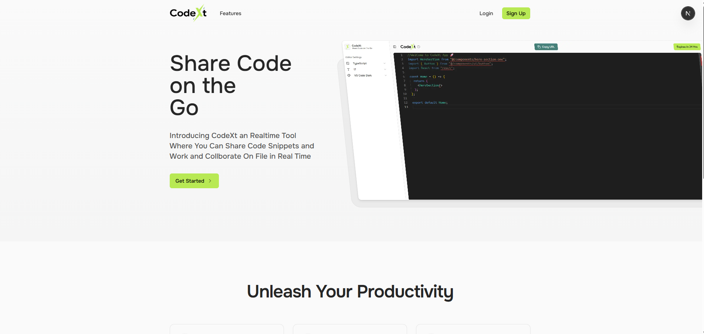
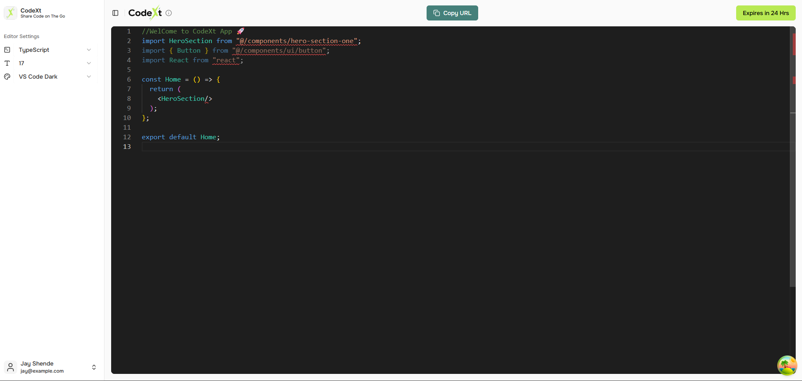
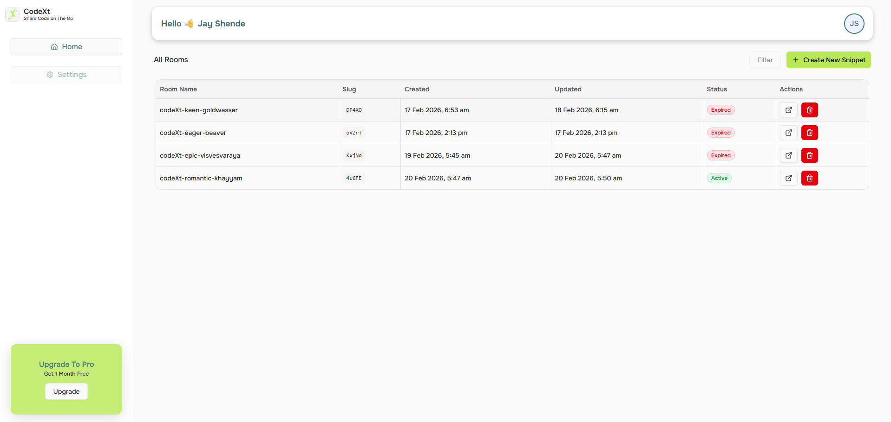

# CodeXt - Share Code on The Go


CodeXt is a real-time collaborative code sharing platform for quick snippets, interviews, debugging sessions, and live demos.

It is built as a Turborepo monorepo with a Next.js frontend, an Express backend, a dedicated WebSocket server, and Prisma + PostgreSQL for persistence.

[](https://wakatime.com/badge/user/3319800a-4f54-4ed9-94d6-1689848d8c5b/project/be72b645-a02d-4438-a908-48d93ad29464)

## Screenshots

### Main App



### Editor



### Dashboard



## Core Features

- **Real-Time Sync:** Collaborate live with instant updates for code content and editor preferences (language, theme, and font settings) across connected users.
- **Powerful Editor Experience:** CodeXt is powered by Monaco Editor, delivering VS Code-like editing with syntax highlighting, smart editing behavior, and a developer-friendly workflow.
- **Language + Theme Flexibility:** Write code in 42+ languages and personalize your environment with 40+ editor themes to match your workflow and visual preference.
- **24-Hour Ephemeral Rooms:** Snippets are designed for fast collaboration and automatically expire after 24 hours, making them ideal for temporary sessions.
- **Instant Start, No Friction:** Start coding immediately without login for quick sharing and collaboration when speed matters.
- **User Dashboard for Management:** Authenticated users get a dashboard to organize, revisit, and manage their saved snippets in one place.

## Tech Stack

### Monorepo + Tooling

- Turborepo
- pnpm workspaces
- TypeScript
- ESLint + Prettier

### Frontend (`apps/frontend`)

- Next.js 16 (App Router)
- React 19
- Tailwind CSS 4
- Monaco Editor (`@monaco-editor/react`)
- TanStack Query
- Redux Toolkit
- React Hook Form + Zod
- Shadcn/Radix UI based components

### Backend API (`apps/backend`)

- Express 5
- Better Auth
- Zod validation
- CORS + dotenv

### Realtime Layer (`apps/websocket`)

- `ws` WebSocket server
- JWT-based room connection token flow
- Real-time code and editor settings broadcast

### Data Layer (`packages/database`)

- Prisma ORM
- PostgreSQL (`pg`)
- Shared DB package across backend + websocket

## Repository Structure

```txt
codext/
|- apps/
|  |- frontend/     # Next.js UI, Monaco editor, dashboard
|  |- backend/      # REST API and auth endpoints
|  |- websocket/    # Real-time collaboration server
|- packages/
|  |- database/     # Prisma schema + shared DB client
|  |- eslint-config/
|  |- typescript-config/
|  |- ui/
|- turbo.json
|- pnpm-workspace.yaml
```

## How It Works

1. A room/snippet is created from the frontend.
2. Backend stores room metadata with a 24-hour expiry and initial snippet.
3. Clients connect to the WebSocket server using a JWT room token.
4. Code edits and editor setting updates are broadcast in real time.
5. Changes are persisted in PostgreSQL through Prisma.
6. Signed-in users can manage rooms/snippets from the dashboard.

## Environment Variables

### Frontend (`apps/frontend/.env`)

```env
WS_JWT_SECRET=""
DATABASE_URL=""
NEXT_PUBLIC_BACKEND_URL="http://localhost:3001/"
```

### Backend (`apps/backend/.env`)

```env
DATABASE_URL=""
PORT="3001"
BETTER_AUTH_SECRET=""
BETTER_AUTH_URL="http://localhost:3001"
```

### WebSocket (`apps/websocket/.env`)

```env
PORT="8080"
WS_JWT_SECRET=""
DATABASE_URL=""
```

## Local Development

### 1) Install dependencies

```bash
pnpm install
```

### 2) Create env files

Copy each `.env.example` to `.env`:

- `apps/frontend/.env.example -> apps/frontend/.env`
- `apps/backend/.env.example -> apps/backend/.env`
- `apps/websocket/.env.example -> apps/websocket/.env`

### 3) Run all apps

```bash
pnpm dev
```

Expected local ports:

- Frontend: `http://localhost:3000`
- Backend: `http://localhost:3001`
- WebSocket: `ws://localhost:8080`

## Available Scripts

From repo root:

- `pnpm dev` - run all workspaces in dev mode via Turbo
- `pnpm build` - build all workspaces
- `pnpm start` - start production processes
- `pnpm lint` - lint all workspaces
- `pnpm check-types` - run type checks

## API Surface (Current)

Backend routes are mounted at `/v1`:

- `/v1/room` - room creation, detail fetching, room listing, deletion
- `/v1/editor` - editor default language/settings updates
- `/api/auth/*` - Better Auth endpoints

## Product Use Cases

- Live interview coding rounds
- Pair programming sessions
- Debugging support snippets
- Quick shareable prototypes
- Temporary collaborative code rooms

## License

ISC
